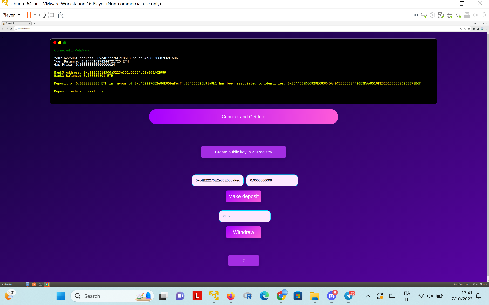
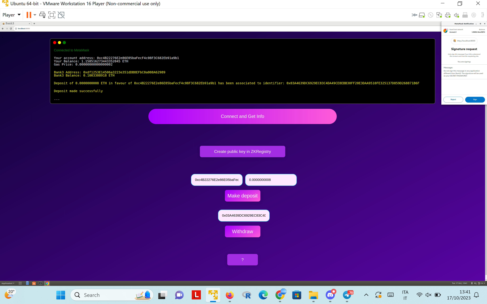

# The Bank3 System
## Overview
The repository provides implementation of the ``Bank3``  protocols described in this [note](https://hackmd.io/q4RHSYE6Tb6fRqgPIML9QA?view
). 

``Bank3`` is essentially an anonymous deposit system (both for Wallets and DAOs) that can be described by the following example. Alice can deposit anonymously ``n`` coins in favour of Bob by sending the coins to the ``Bank3`` contract. At any point of time Bob will hold ``m>n`` coins at the ``Bank3``  contract, and nobody will be able to infer how much wealth Bob holds. Bob can withdraw the ``n`` coins deposited by Alice in favour of him using just the ability to use his personal wallet. After withdrawal, the fact that Alice deposited ``n`` coins in favour of Bob will be public but it will not be possible to leak how many more coins Bob holds at the ``Bank3``.

Therefore, ``Bank3`` is *NOT* a coin mixer but presents the following differences and advantages with respect to Trnad0 C@sh (``TC``):
 * A ``TC`` deposit+withdrawal can consume more than 1.3/1.4 milions of GAS whereas in our current ``Bank3`` implementation a deposit (resp. withdrawal) costs about 68k (resp. 35k) and likely we can lower the deposit cost a bit more!
 *   ``TC`` runs in fractions of a minute on powerful laptops whereas ``Bank3`` can run in fractions of a second even on mobile devices.
 * ``Bank3``  is user-friendly. If Alice fails to save the deposit receipt or Bob loses it, Bob can at any time do an ether scan to find all anonymous deposits in favour of him and be able to make a corresponding withdrawal. This is not currently implemented but it is an easy addon for next versions.
* ``Bank3`` requires only hashing on-chain  and as such is very portable and efficient. A slight variant of ``Bank3`` might be likely implemented also in ``Bitcoin``!
* ``Bank3`` does not require trusted setup and is based on standard computational assumptions, namely the hardness of breaking discrete logs over elliptic curves whereas it is known that any system based on SNARKs as ``TC`` cannot be proven secure from falsifiable assumptions.
 * ``Bank3`` security is weaker than ``TC``: after withdrawal it is visible that Bob made the deposit. This is by design: the purpose here is just to hide the Bob's left wealth at the ``Bank3`` and not to mix the coins. This should not pose legal issues as for coin mixers.

The repository contains a smart contract module in Solidity and the off-chain module written in C/Wasm-emscripten/Javascript.

## Installation for the off-chain module
```bash
./install.sh
```
To install the ``js`` and `wasm` modules, run:
```bash
make js-wasm
```
The compilation will use some precompiled ``libcrypto.a``. If the compilation does not work, you may need to compile ``openssl`` with ``emscripten`` by yourself: it may require some tweaks to the ``Makefile``, feel free to contact me if you need help.
## Bank3 for Wallets: Demo
We provide a web demo for Goerli testnet.
To run the demo you don't need to install anything.
Go to the ``demo`` folder, setup the demo with the following command:
```bash
./demo.sh
```
and run a web server like:
```bash
python3 -m http.server 8000
```
Then open ``localhost:8000`` in your browser.

### Instructions
* Click on "Connect and Get Info" to connect to your Wallet and get information about yours and Bank3's account.
*  Click on "Create public key in ZKRegistry" to generate a public key to be added into the ``ZKRegistry``. This is a registry that eases the Bank3's account system avoiding to request users to extract their Wallet's secret key. This operation has to be done only once for all the future deposits and withdrawal. You will be prompted to sign a message. Be aware that this signature will be used internally by the system as your secret password so don't sign the message in any other application or website!
*  Input the address of the person in favour of whom you want to make a deposit and an amount in ether and click on "Make deposit". After about 20secs the transaction will be accepted and you will receive an identifier associated with the deposit. Copy it or share it privately with the person in favour of whom you made the deposit. If you click on "Connect and Get Info" you should see a change in yours and Bank3's balances.
*  When you want to withdraw input a previously generated identifier and click on "Withdraw". You will be asked to sign the same message as at the time of creation of your public key into the ``ZKRegistry``. After about 20secs your withdrawal should be successful and if you click on "Connect and Get Info" you should see a change in yours and Bank3's balances.


### Screenshots

<br>

<br>


## Example of usage for Bank DAO

### Deployment phase
We deploy both contracts `solidity/bankdao/GenericDAO.sol` and `solidity/bankdao/BankDAO.sol`. 
The former represents a generic DAO contract and let us suppose that its address is `9cF86D8D08bC34248210474C4B019befb0fE70fA`.
The constructor of the latter needs a parameter of type `uint256` that can be set to `0` because it currently not used.

### Initialization phase
First, we need the DAO members to compute a PK and the respective secret shares for that.
```bash
vincenzo@ubuntu:~/bank3$ ./bin/bankdao/generate_shares 3 5
s:9887DD54CD8E52F32338ECBE2B9F5220483BC55E9466BC9247950B333805BA47
PK:0x0323658C358FFD1903F2D6A405C14C23BA1420A7B13B1D8B7BF9A92024E2751E36
Share 1:39F5868C0970459F34831C83F8ABBB0BD70D569576C7FAA3F60828BD4C4B4F37
Share 2:1E3E8231BD161DA36861ABD55FD0F5CD3E30E720CD345514C133DFE859524F48
Share 3:4562D045E87FDAFFBED49AB2610F02647DA6770097ABCBE4A91830B45F1ABA7A
Share 4:AF6270C88BAD7DB437DBE91AFC65E0D1956E0634D62E5F13ADB51B215DA490CD
Share 5:5C3D63B9A69F05C0D377970F31D59115CAD8B7D6D9736E660F3840A284B99100
```
With the previous command we simulate a DKG protocol for 5 parties with reconstruction threshold 3 that computes a public-key `PK` and the 5 shares to distribute to the respective users.
A full DKG protocol is not part of this implementation but either you can run the previous command on a trusted machine and modify the code so as to distribute the shares to each user over the network or you can use any secure DKG protocol among the parties for the `secp256k1` curve. In the latter case you can still use the next commands without any change.
Henceforth, we assume that user i=1,...,5 has the share i shown above. The user can be a DAO member or even an external party (e.g., accountant, administrator).

Now, we can invoke the function `setPK` of the contract `GenericDAO.sol` with input parameter the public key `PK` shown before.

### Deposit phase
Now suppose a user Alice wants to deposit `1000 wei` in favour of the generic DAO contract.
Then, it executes the following command:
```bash
vincenzo@ubuntu:~/bank3$ ./bin/commons/encrypt 0323658C358FFD1903F2D6A405C14C23BA1420A7B13B1D8B7BF9A92024E2751E36 9cF86D8D08bC34248210474C4B019befb0fE70fA
A:0x025E7C20C190C943A02C1C1456ADCD60BB60F7F67618A96B55D9FFD492A483CE87
B=0x65004d5d2d63ace0a6e855060be78f09e24ad0fd6a56cced9723cf093fea8ba7
```
The first argument to the program is the previously computed public key `PK` and the second is the address of the generic DAO contract.
Also, note that our programs take as input hexadecimal strings without the prefix `0x` whereas for the transactions you will need to submit on-chains the prefix is needed.

Alice can invoke the method MakdeDeposit of the `BankDAO.sol` contract with inputs the values `A` and `B` from the above output and setting as value for the transaction `1000 wei`.
If the transaction was successfull, it will return an identifier `id` that for the first execution will be just the integer `0`.
You can observe that the Bank DAO contract's funds increased by the corresponding quantity.
Alice can pass the identifier `id` privately to the DAO members as reference for future withdrawals. This is not really needed but makes the withdrawal more efficient.

### Approval phase
Suppose that the DAO members of the generic DAO contract or some of them are aware that they hold at the Bank `1000 wei` and they want to withdraw from the Bank `100 wei`.
They can make a proposal to withdraw such amount of coins. We suppose that proposals are associated with an index `t` of type `uint256` and there is an hash map `proposals` from `uint256` to `uin256` such that `proposal[t]=x` iff the proposal `t` concerned the withdrawal of `x` coins and has been approved. So, a DAO needs just to update the map `proposals` in order to be compatible with the Bank DAO.
So let us suppose that this is done, that is `proposals[1]=100`. This is done in the contract `GenericDAO.sol` using the method `ApproveProposal(uint t,uint256 nCoins)`.

### Withdrawal phase

#### Off-chain part
Since the generic DAO was sharing the public key via a protocol with threshold `3`, we need `3` members to participate in the witness computation phase that occurs off-chain.
Let us suppose that the users to participate in the reconstructions are the users `1,2,4`.
Then, user `1` on his computer runs the following command:

```bash
vincenzo@ubuntu:~/bank3$ ./bin/bankdao/compute_share_for_withdrawal 025E7C20C190C943A02C1C1456ADCD60BB60F7F67618A96B55D9FFD492A483CE87 39F5868C0970459F34831C83F8ABBB0BD70D569576C7FAA3F60828BD4C4B4F37
Share to broadcast to other users (along with your user index): 03EC43DF01687023902B177F3BC33A3DB389AD68341A602C97A7F4A0B635647888
```
The first argument to the above program is the value `A` computed before by the program `encrypt` and the second is the share of user `1` (cf. the execution of the program `generate_shares`).
Similarly, user `2` (but with his own share that is different from the one of user `1`):
```bash
vincenzo@ubuntu:~/bank3$ ./bin/bankdao/compute_share_for_withdrawal 025E7C20C190C943A02C1C1456ADCD60BB60F7F67618A96B55D9FFD492A483CE87 1E3E8231BD161DA36861ABD55FD0F5CD3E30E720CD345514C133DFE859524F48
Share to broadcast to other users (along with your user index): 032517096E7A35CE9E43B152E203B2163933A747F9BEEE75E904BE386BB7F4391D
```
And user `4`:
```bash
vincenzo@ubuntu:~/bank3$ ./bin/bankdao/compute_share_for_withdrawal 025E7C20C190C943A02C1C1456ADCD60BB60F7F67618A96B55D9FFD492A483CE87 AF6270C88BAD7DB437DBE91AFC65E0D1956E0634D62E5F13ADB51B215DA490CD
Share to broadcast to other users (along with your user index): 029765BB499A59D5EEB97A4FBDEE9F872C13ABD2547B9AD3036101C74B58D81E13
```
Let us call `S1,S2,S4` be the outputs of the previous program executions respectively for users `1,2,4`.
Now, the users `1,2,4` can broadcast each other their values `S1,S2,S4`. They can do that e.g. via e-mail.
Now, any of them can execute the following program to compute the witness `C` that is actually needed to make a withdrawal:

```bash
vincenzo@ubuntu:~/bank3$ ./bin/bankdao/witness_for_withdrawal 3 1 03EC43DF01687023902B177F3BC33A3DB389AD68341A602C97A7F4A0B635647888 2 032517096E7A35CE9E43B152E203B2163933A747F9BEEE75E904BE386BB7F4391D 4 029765BB499A59D5EEB97A4FBDEE9F872C13ABD2547B9AD3036101C74B58D81E13
Witness C: 023C9C232F8D527AB5780BC679185424DBCA273DFAA4E1D48B501AF2D28B8AE25E
```
The program takes as input the threshold `3` and the values `1 S1 2 S2 4 S4` where `S1,S2,S4` are as specified before.
The value `C` in the output of the previous execution is the witness that will be used to make the withdrawal.
#### On-chain part
Let us say that the user `1` is responsible to make the withdrawal.
The user `1` invokes the method `MakeWithdrawalSha256` of the Bank DAO contract with the following parameters: 
`t=1`, the proposal accepted in the Generic DAO.
`nCoins=100`, the amount of coins to withdraw from the Bank.
`addr=9cF86D8D08bC34248210474C4B019befb0fE70fA` , the address of the generic DAO contract in favour of which the withdrawal is performed, 
`id=0`, the identifier of the deposit of Alice that was for the amount `1000wei >100 wei`).
`C=0x023C9C232F8D527AB5780BC679185424DBCA273DFAA4E1D48B501AF2D28B8AE25E`, the witness computed above.
The transaction will transfer `100 wei` from the Bank contract to the generic DAO contract.
With the same witness you can actually repeat the same process `10` times until all `1000 wei` consume the deposit of Alice.

The user can also do the previous procedure by replacing `MakeWithdrawalSha256` with `MakeWithdrawalKeccac256` but in this case in the deposit phase it should use the program `encrypt_keccac` instead of `encrypt`.
## References
Vincenzo Iovino. [Bank3: enabling deposits and withdrawals from Wallets and DAOs in a private and decentralized way](https://hackmd.io/q4RHSYE6Tb6fRqgPIML9QA?view), 2023.
